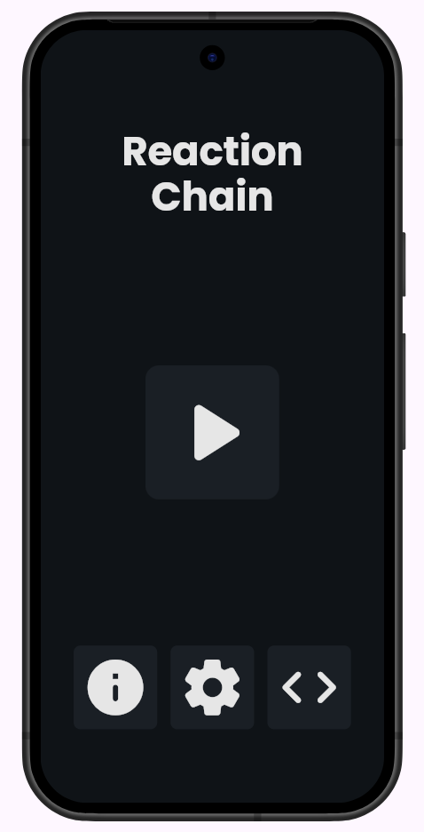
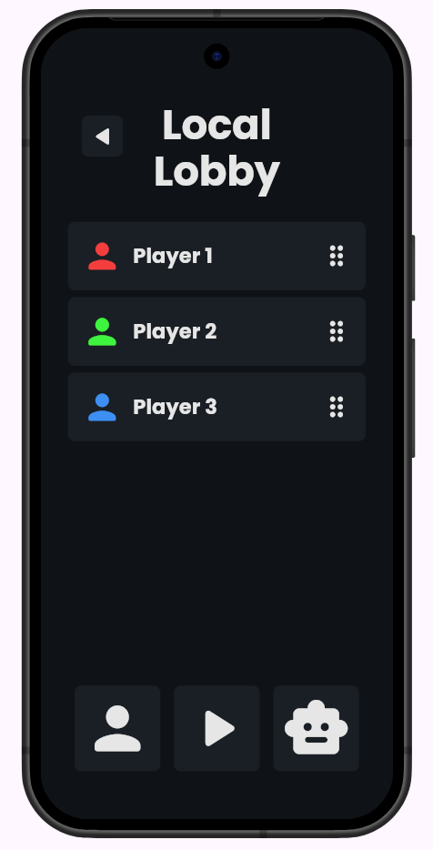
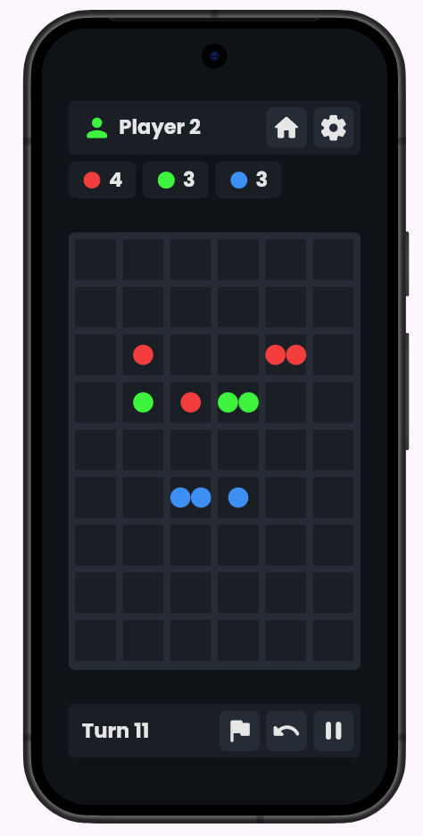

# Reaction Chain

> For board game enthusiasts looking for a better [Chain Reaction](https://play.google.com/store/apps/details?id=com.BuddyMattEnt.ChainReaction&hl=en) experience. 

- **Live demo:** [enetwarch.github.io/reaction-chain/](https://enetwarch.github.io/reaction-chain/)
- **Demo video:** `docs/demo.mp4` (link it here once it exists)
- **Course:** Applications Development and Emerging Technologies (6ADET), Holy Angel University
- **Author:** Enetwarch

## Project structure

```yaml
reaction-chain/
├── docs/ # proposal, mockups, weekly reports, screenshots
├── lib/ # app source code
│   ├── controllers/ # state and logic (MVC controller)
│   ├── data/ # plain data classes (MVC model)
│   ├── screens/ # full-page views (MVC view)
│   ├── theme/ # design tokens, shared styling
│   ├── widgets/ # reusable multi-widget components
│   └── main.dart # app entry point
├── web/ # web platform target
├── AI-USAGE.md # AI usage log
├── README.md # this file
└── pubspec.yaml # dependencies
```

## Screenshots

| Home | Local Lobby | Game |
| --- | --- | --- |
|  |  |  |

## What it does

- The user can create a custom lobby, with a minimum of 2 and maximum of 4 players.
- The user can play a full local match of Chain Reaction, placing orbs and triggering chain reactions until only one player remains.
- The user can adjust game settings such as sound, music, vibration, and move confirmation. (WIP)
- The user can resign from an ongoing match if they no longer wish to continue. (WIP)
- The user can undo a move or pause the game mid-match. (WIP)

## How to use it

1. **Home screen.** Tap **Play** to start a new game. The info button links to the official Chain Reaction rules, settings opens app preferences, and the source code button links to this repository.
2. **Local lobby.** Add 2 to 4 players. Tap a player card to edit their name or color; use the drag handle to reorder players. Once everyone is set, start the match.
3. **Game screen.** Players take turns placing orbs on the board. When a cell overloads, it triggers a chain reaction into neighboring cells. The last player with orbs remaining wins.

## Built with

| | |
| --- | --- |
| Framework | Flutter (Dart) |
| State | `setState`, `ListenableBuilder` |
| Storage | `shared_preferences` |
| Other packages | `just_audio` for SFX |

## Running it yourself

```bash
git clone https://github.com/enetwarch/reaction-chain # Skip this line if the repository is already cloned. 
flutter pub get # Downloads the necessary Flutter packages for this project.
flutter run -d web-server --web-port 8080 # Run in local browser.
```

Then open http://localhost:8080. Requires Dart version `3.12.2`, Flutter version `3.41.9`. If this is ran successfully, you should see the home screen with a Play button in the center and info, settings, and source code buttons along the bottom.

## Privacy and secrets

- The app does not store any personal or sensitive data. All data lives in the local storage with the use of `shared_preferences`.
- There are no `.env` files involved in this project as no API or online services are used.

## Project documentation

| Document | |
| --- | --- |
| [Proposal](docs/01-proposal.md) | the problem, the users, the scope |
| [Mockup and wireframes](docs/02-mockup.md) | what it looks like, and the screen flow |
| [Design system](docs/03-design-system.md) | colors, type, spacing, components |
| [Weekly reports](docs/04-weekly-reports.md) | what happened each week |
| [Demo video](docs/05-demo-video.md) | the recording and what it shows |
| [Security and privacy](docs/06-security-and-privacy.md) | the checklist, filled in |

## Status and what is next

To summarize, the home page and local lobby page are basically complete, with some refinements for later. The game page has its functionality down, but lacking in animations, which is the next focus in development.

## Credits

- Packages: see [`pubspec.yaml`](./pubspec.yaml)
- Assets, icons, 3D models, sounds: (none so far)
- People who helped: (none so far)

## AI use


I mostly used AI tools to help me self-study Flutter classes and packages I will use in this project. However, this project is still built with AI assistance. See [`AI-USAGE.md`](./AI-USAGE.md)

## Licence

MIT, see [LICENSE](LICENSE).
