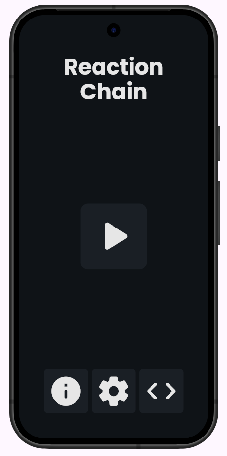
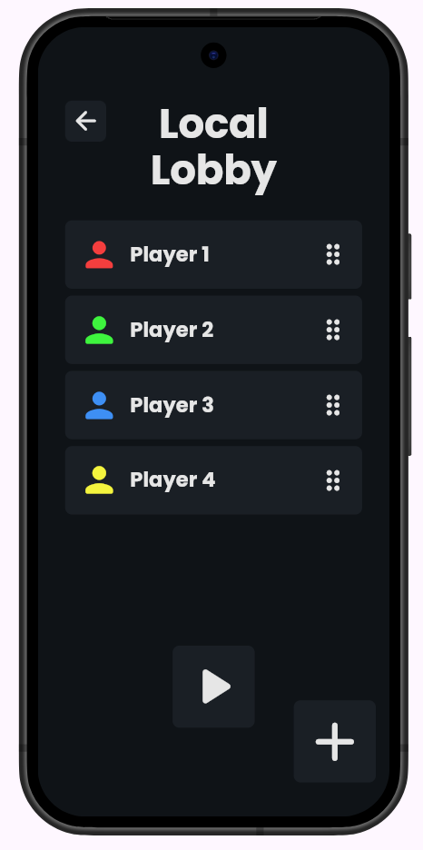
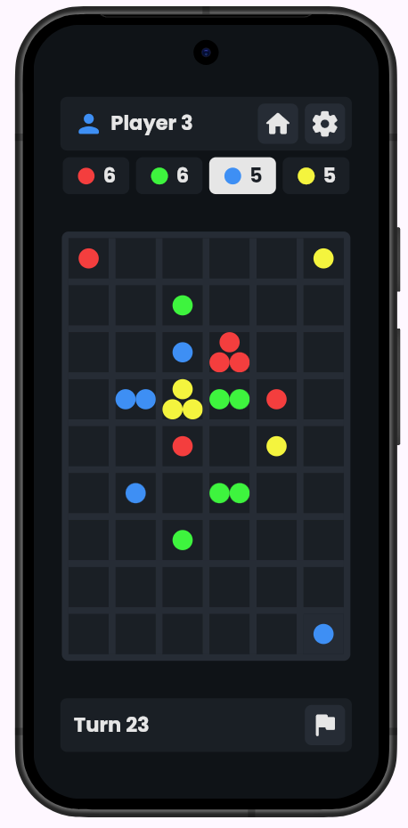

# Reaction Chain

> A customizable local multiplayer version of the classic [Chain Reaction](https://play.google.com/store/apps/details?id=com.BuddyMattEnt.ChainReaction&hl=en), built with Flutter.

- **Live demo:** [enetwarch.github.io/reaction-chain](https://enetwarch.github.io/reaction-chain/)
- **Demo video:** See [`docs/05-demo-video.md`](docs/05-demo-video.md)
- **Course:** Applications Development and Emerging Technologies (6ADET), Holy Angel University
- **Author:** Enetwarch

## Project structure

```yaml
reaction-chain/
├── docs/ # project documentation and assets
├── lib/
│   ├── controllers/ # game and player-list state management
│   ├── data/ # data models and game data
│   ├── providers/ # local storage provider
│   ├── screens/ # home, lobby, and game screens
│   ├── theme/ # design tokens, colors, and dimensions
│   ├── widgets/ # reusable UI components
│   └── main.dart # app entry point
├── web/ # Flutter web platform files
├── AI-USAGE.md # AI assistance log and reflection
├── SECURITY-CHECKLIST.md # security review checklist
├── README.md # project overview
└── pubspec.yaml # dependencies and project configuration
```

## Screenshots

| Home | Local Lobby | Game |
| --- | --- | --- |
|  |  |  |

## What it does

- **Local multiplayer:** Play with 2–4 players on one device.
- **Customizable players:** Edit player names and colors, and reorder the player list.
- **Chain Reaction gameplay:** Place orbs in cells and trigger chain reactions when cells reach their critical mass.
- **Game state management:** Track turns, player ownership, and chain reactions until one player remains.
- **Settings:** Configure available preferences such as sound, music, vibration, and move confirmation.
- **Local persistence:** Save player configuration, settings, and game state using `shared_preferences`.
- **Gameplay feedback:** Highlight the current player's score card and animate orb placement and chain reactions.

Online multiplayer and computer-controlled opponents are outside the current implementation scope. Some planned controls, including undo, redo, pause, and resignation, may remain unfinished.

## How to use it

1. **Home screen:** Select **Play** to start a new game. Use the available information, settings, and source-code buttons to access their respective features.
2. **Local lobby:** Add 2–4 players, edit their names and colors, and reorder them using the drag handles. Start the match when the lobby is ready.
3. **Game screen:** Players take turns placing orbs on the board. When a cell reaches its critical mass, it explodes into adjacent cells and can trigger further chain reactions. The goal is to be the last player remaining with orbs on the board.

## Built with

| Technology | Purpose |
| --- | --- |
| Flutter and Dart | Cross-platform UI and application logic |
| `setState` and `ListenableBuilder` | UI updates and state listening |
| `shared_preferences` | Local persistence |
| `flutter_soloud` | Sound effects |
| `device_preview` | Device and layout preview during development |

The project uses a controller-based structure inspired by MVC, separating data models, state management, screens, and reusable widgets.

## Running it locally

### Requirements

- Flutter `3.41.9`
- Dart `3.12.2`

### Steps

```bash
git clone https://github.com/enetwarch/reaction-chain.git
cd reaction-chain
flutter pub get
flutter run -d web-server --web-port 8080
```

Open [http://localhost:8080](http://localhost:8080) in your browser.

The app should open on the Home screen, where you can access the local multiplayer lobby and other available features.

## Privacy and security

- The app stores player configuration, settings, and game state locally using `shared_preferences`.
- The app does not use a remote backend or require API keys, tokens, or other runtime secrets.
- Local storage is not intended to protect data from someone with access to the device.
- The repository's security review is documented in [`SECURITY-CHECKLIST.md`](SECURITY-CHECKLIST.md).

## Project documentation

| Document | Description |
| --- | --- |
| [Proposal](docs/01-proposal.md) | Problem, intended users, and project scope |
| [Mockup and wireframes](docs/02-mockup.md) | Screen designs and navigation flow |
| [Design system](docs/03-design-system.md) | Colors, typography, spacing, and reusable components |
| [Weekly reports](docs/04-weekly-reports.md) | Development progress, decisions, and blockers |
| [Demo video](docs/05-demo-video.md) | Demonstration recording and overview |
| [Security and privacy](docs/06-security-and-privacy.md) | Security and privacy assessment |

## Status and next steps

The Home screen, Local Lobby, player customization, settings, and local persistence have been implemented. The core local gameplay is functional, with ongoing work focused on animation polish and the remaining gameplay controls.

Potential next steps include:
- Further polish orb and chain-reaction animations.
- Complete or reassess unfinished controls and dialogs.
- Continue testing responsive layouts and saved-game behavior.
- Improve the security of the deployment workflow by pinning third-party GitHub Actions to verified commit SHAs.

Online multiplayer and bots are not part of the current MVP.

## Credits

- **Dependencies:** See [`pubspec.yaml`](pubspec.yaml).
- **Assets:** No custom assets are currently documented; built-in Material icons and package-provided fonts are used.
- **People who helped:** None listed.

## AI use


AI tools were used to support Flutter learning, implementation, debugging, refactoring, and documentation. The project also includes independent design decisions, integration work, testing, and fixes to AI-generated solutions.

See [`AI-USAGE.md`](AI-USAGE.md) for the detailed usage log, examples of incorrect AI suggestions, and a record of personal contributions.

## License

MIT. See [`LICENSE`](LICENSE).
