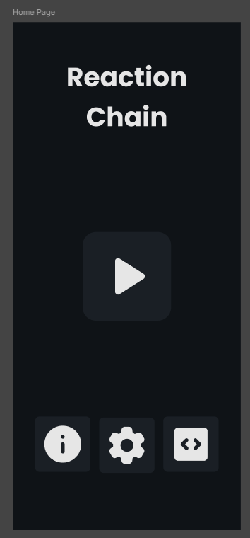
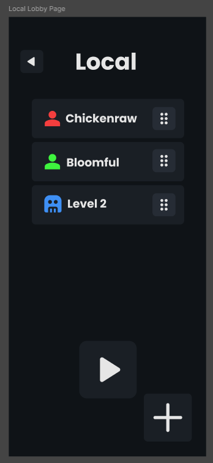
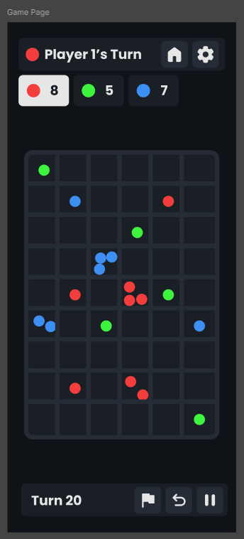
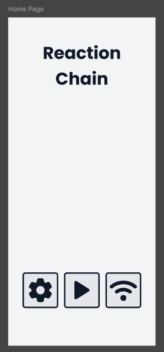
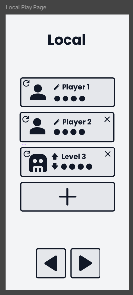
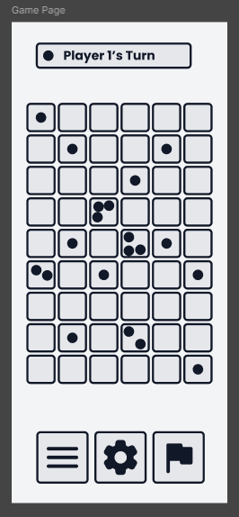

# Mockup and wireframes

<!--
The visual plan for this app. Your wireframes answered what goes where; the
mockup shows what it looks like.
-->

The mockup defines the visual design and intended interactions of Reaction Chain. It develops the initial wireframes into a dark-themed interface with bright player colors, reusable dialogs, and clearer navigation.

## Mockup

<!--
Put your mockup images or PDF in `assets/` and embed them here, one heading per
screen.

_(Embed your mockup here once it is in `assets/`.)_
-->

### Home Screen

The home Screen features a prominent Play button in the center, with buttons at the bottom for viewing the game rules and accessing the source code. The Play button is emphasized because starting a game is the primary purpose of the application.

### Local Lobby Screen

The Local Lobby allows users to configure a game before starting. Players are displayed as cards in a list that supports drag-and-drop reordering. A floating action button expands into options for adding a human player or a bot. Selecting a player opens a dialog for editing their information.

### Game Screen

The Game Screen uses a dark theme with bright player colors. It includes the game board, a status bar, player score information, and a bottom panel containing turn information and gameplay actions.

The mockup also planned tools such as undo and pause to improve the gameplay experience.

### Design Reference

The original mockup and design work are available in Figma:

[Figma — Reaction Chain](https://www.figma.com/design/BY6UChH70KXWE16cVec6j4/Reaction-Chain?node-id=75-237&t=mauhqzWhhivnHTGP-1)

## Wireframes

<!--
Your earlier box-and-label sketches and the screen flow: which screen opens
first, and how a user moves between them. Photos of paper are fine.

_(Embed your flow diagram and sketches here once they are in `assets/`.)_
-->

The original wireframes established the initial layout of the Home Screen, Local Play Screen, and Game Screen. The mockup changed the placement of buttons, introduced a floating player-add control, and redesigned the game interface.

## Screens

<!--
One short section per screen: what is on it, what the user does, and where each
action goes.
-->

### Home Screen

The first screen users see when opening the application. It provides a central Play button and access to the game rules, settings, and source code.

- **Play:** Opens the Local Lobby.
- **Rules:** Opens the external game-rules resource.
- **Settings:** Opens the Settings Dialog.
- **Source Code:** Opens the project's GitHub repository.

### Local Lobby Screen

Allows users to configure a local match with two to four players.

- Add players using the floating action button.
- Edit player names and colors through player dialogs.
- Reorder players by dragging their cards.
- Start the match after configuring the players.

Starting the match opens the Game Screen.

### Game Screen

Displays the game board, current player information, and the controls needed during a match.

- Tap an eligible cell to place an orb.
- Trigger chain reactions when a cell reaches its critical mass.
- Use move confirmation and cell highlighting when enabled in settings.
- Continue playing until a winner is determined.

Undo, pause, and resign were included in the original design plans but remain works in progress.
