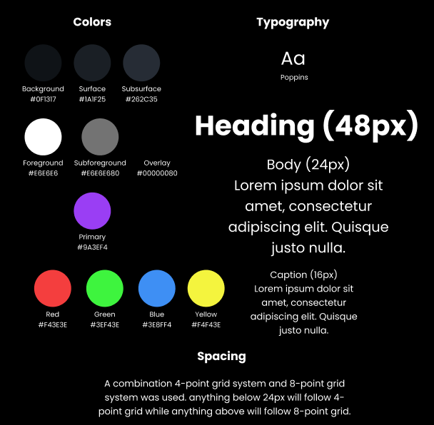

# Design system

## Palette

| Role | Color | Usage |
|---|---|---|
| Background | `#0F1317` | Main background |
| Surface | `#1A1F25` | Dialogs and elevated UI elements |
| Subsurface | `#262C35` | Secondary elements inside dialogs |
| Foreground | `#E6E6E6` | Default text |
| Subforeground | `#E6E6E6` at 50% opacity | Less important text |
| Overlay | `#000000` at 50% opacity | Dialog background overlay |
| Primary | `#D178FE` | Important text and UI highlights |
| Red | `#F43E3E` | Player color |
| Green | `#3EF43E` | Player color |
| Blue | `#3E8FF4` | Player color |
| Yellow | `#F4F43E` | Player color |

The palette is manually defined rather than generated with `ColorScheme.fromSeed` to provide greater control over contrast, especially between the dark interface and the four player colors.

## Type scale

| Style | Flutter slot | Size | Weight | Usage |
|---|---|---:|---|---|
| Heading | `displayLarge` | 48 px | Bold | Screen titles |
| Body | `displayMedium` | 24 px | Regular | Normal text |
| Caption | `displaySmall` | 16 px | Regular/light | Small labels and popups |

## Spacing

Spacing and sizing values are managed through the `AppDimensions` class.

| Name | Value | Usage |
|---|---:|---|
| Tight spacing | 4 px | Between board cells |
| Standard spacing | 16 px | Between related elements, such as buttons |
| Large spacing | 36 px | Between loosely related elements |
| Screen edge padding | 24 px or 48 px | Spacing around screen content |

## Components

<!--
One row per reusable widget: what it is, which file it lives in, what parameters
it takes, which screens use it.
-->

| Component | File | Constructor parameters | Screens |
|---|---|---|---|
| Player Card Dialog | `lib/widgets/player_card_dialog.dart` | `Player player`, `VoidCallback onDelete`, `VoidCallback onClose` | Local Lobby |
| Settings Dialog | `lib/widgets/settings_dialog.dart` | `Settings settings` | Home, Game |
| Confirmation Dialog | `lib/widgets/confirmation_dialog.dart` | `Icon icon`, `String message`, `VoidCallback onConfirm`, `VoidCallback onCancel` | Home, Game |
| Icon Button | `lib/widgets/icon_button.dart` | `Icon icon`, `ButtonSize size` | Home, Local Lobby, Game |
| Board Widget | `lib/widgets/board_widget.dart` | `Board board`, `void Function(Coordinates) onCellTap` | Game |

## Changes since the last version

- **Player Card → Player Card Dialog:** Player editing operations were moved into a dialog to reduce clutter and prevent accidental interactions caused by stacking CRUD actions directly in a player list.
- **Cell → Board Widget:** The component was expanded to manage groups of cells, allowing the Game Screen to pass a `Board` object rather than construct the entire grid itself.
- **Button → Icon Button:** The design was simplified to use icon-only buttons instead of text buttons, supporting a cleaner, more minimalist, game-oriented interface.
